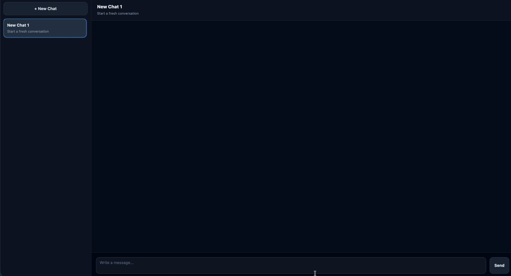

WEEK 2

### Added

- Two-column layout (sidebar + main chat area)
- Sidebar with:
  - "New Chat" button
  - Multiple conversations
  - Active conversation styling
- Scrollable message list
- Pinned input bar at the bottom
- Textarea input field
- Alternating message alignment (AI left, User right)

### Changed

- Refactored message rendering to use custom element instead of plain divs
- Updated CSS to support new layout structure

---

WEEK 3

### Added

- Split JavaScript into ES modules:
  - `main.js` for app entry and event listeners
  - `chat.js` for DOM manipulation and custom `chat-message` element
  - `api.js` for OpenRouter fetch + streaming logic
- Streaming chat integration with `https://openrouter.ai/api/v1/chat/completions`:
  - Sends full `messages` history with `stream: true`
  - Reads SSE chunks with `ReadableStream` + `TextDecoder`
  - Appends AI reply to the assistant bubble as deltas arrive
- Conversation state:
  - Maintains `messages` array across turns
  - Pushes full assistant reply into history after each streamed response
- Sidebar behavior:
  - `New Chat` button clears messages and resets history
  - Sidebar items toggle active state, update header, and start a fresh thread

WEEK 4

### Added

- Rebuilt the project as a React + Vite app with component-based architecture.
- Added a Sidebar area with focused child components (`NewChatButton`, `ConversationList`, `ConversationItem`).
- Added a Chat panel area with focused child components (`ChatHeader`, `MessageList`, `MessageItem`, `MessageForm`, `LoadingIndicator`).
- Added a mock API layer under `src/api/`:
  - `conversationsApi.js` with in-memory conversation data and promise-based methods.
  - `messagesApi.js` with in-memory message data and promise-based methods.
  - `llmApi.js` for OpenRouter completion requests (with a local fallback when no key is set).
- Added pre-populated in-memory conversations/messages so the app has initial data on load.
- Added loading indicator while waiting for AI reply.

### Changed

- App state now uses `useState` in `App.jsx` for active conversation + messages.
- Added `useEffect` in sidebar flow for loading conversations on mount.
- Added `useEffect` in app flow for loading messages when active conversation changes.
- Replaced static HTML bootstrapping with React mount (`#root`).
- Added Tailwind via CDN in `index.html`.

### Run

- Local: `npm install` then `npm run dev`
- Build: `npm install` then `npm run build`
- Test: `npm install` then `npm run lint`

WEEK 5

### Added

- Migrated from React + Vite to **Next.js 15 App Router** with TypeScript.
- File-based routing with dynamic route `/conversations/[conversationId]`.
- Server-side API routes under `src/app/api/`:
  - `GET/POST /api/conversations` for conversation CRUD.
  - `GET/POST /api/conversations/[conversationId]/messages` for message CRUD.
- File-based persistence layer in `src/app/api/_store.ts` (`.data/` folder).

### Changed

- Data layer moved from client-side in-memory to server-side with file persistence.
- OpenRouter API key now only accessible server-side (`.env.local`).
- API client functions now use relative URLs to local API routes instead of in-memory arrays.
- Tailwind upgraded to v4 with `@tailwindcss/postcss` integration.
- UI for messages: user message appears immediately, replaced with server response after AI reply.

### Run

- Local: `npm install` then `npm run dev` (runs on `http://localhost:3000`)
- Build: `npm install` then `npm run build`
- Lint: `npm install` then `npm run lint`

WEEK 6

### Added

- Prisma-backed persistence with schema models for `Conversation` and `Message`.
- Server modules under `src/server/` for DB-backed conversation/message operations.
- Streaming response endpoint for chat generation at `POST /api/conversations/[conversationId]/stream`.
- Client hooks for data handling (`src/hooks/conversations.ts`, `src/hooks/messages.ts`).

### Changed

- API handlers now use structured server helpers instead of the older file-store approach.
- Chat flow is organized around a selected conversation with incremental updates in the UI.
- Project structure now separates `components`, `hooks`, `server`, and `lib` for easier maintenance.

### Run

- Dev: `npm run dev`
- Build: `npm run build`
- Lint: `npm run lint`

WEEK 7 (SERVER-FIRST + AI SDK)

### Added

- A dedicated server-side data access layer in `src/server/chat-dal.ts` to centralize conversation/message database queries.
- Optimistic sidebar mutations for create/delete conversation flows with rollback on failure.
- Server-refresh flow after mutations (`router.refresh()`) so SSR sections stay in sync.

### Changed

- API routes now act as wrappers and delegate persistence work to the shared server data layer.
- Continued the streaming flow using Vercel AI SDK hooks + streaming route, with message persistence handled server-side.
- Sidebar conversation data is fetched server-side and rendered from database-backed data.
